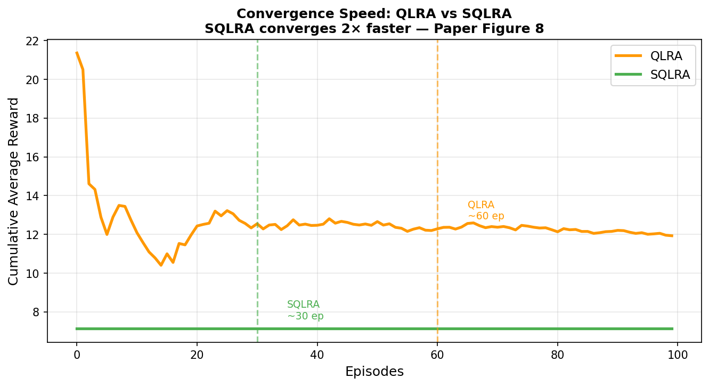
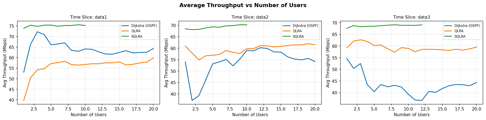
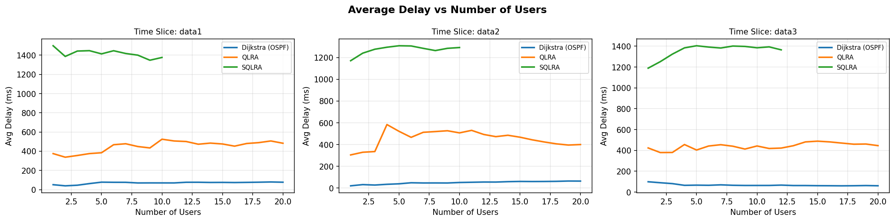

# Satellite Network Routing using Q-Learning

[](https://www.python.org/)
[](https://opensource.org/licenses/MIT)

An implementation of reinforcement learning-based routing algorithms for Satellite-Terrestrial Integrated Networks (STINs). This project focuses on optimizing routing paths in dynamic satellite constellations using **QLRA** and **SQLRA** as proposed by Yin et al. (2021).

---

## 🌟 Overview

Satellite networks, especially Low Earth Orbit (LEO) constellations, present unique challenges for routing due to high mobility, frequent topology changes, and varying link qualities. This project implements and compares three routing strategies:

1.  **Dijkstra (Baseline):** A traditional shortest-path algorithm (similar to OSPF) based on hop counts.
2.  **QLRA (Q-Learning Routing Algorithm):** A reinforcement learning approach that optimizes for multiple metrics (bandwidth, delay, BER, etc.).
3.  **SQLRA (Speed-Up QLRA):** An advanced version of QLRA using BFS-based back-to-front updates to significantly improve convergence speed and routing efficiency.

## 📂 Project Structure

```text
.
├── satellite_routing.py       # Main simulation script (All-in-one)
├── Satellite_QL_Routing.ipynb # Interactive analysis notebook
├── data1,2,3.xlsx             # Topology adjacency matrices
├── satellite_results/         # Directory for output plots/metrics
├── RL/                        # Modular RL implementation
│   ├── env.py                 # Satellite network environment
│   ├── train.py               # Training loops and logic
│   └── rl.py                  # Core Q-Learning agents
├── Topologies/                # Scripts for topology generation
│   ├── generate_matrices.py   # Adjacency matrix creator
│   └── generate_nodes_topo.py # Node & ISL configuration
└── rlrouting/                 # Optimized routing algorithms
```

---

## 🚀 Key Features

- **Multi-Metric Optimization:** Rewards calculated based on Bandwidth, Delay, BER, and Link Visibility.
- **Dynamic Topology Support:** Handles time-varying adjacency matrices from Excel datasets.
- **Performance Benchmarking:** Comparative analysis between Dijkstra, QLRA, and SQLRA.
- **Rich Visualizations:** Automatically generates convergence plots and metric comparison charts.

---

## 🛠️ Tech Stack

- **Language:** Python 3.8+
- **Network Analysis:** `networkx`
- **Data Handling:** `pandas`, `openpyxl`, `numpy`
- **Visualization:** `matplotlib`

---

## 📊 Methodology

### Reward Function
The agent receives rewards based on the weighted sum of normalized link attributes:
$$R = \theta \cdot r(b) + \beta \cdot r(d) + \lambda \cdot r(e) + \omega \cdot r(t)$$
Where $b$ is bandwidth, $d$ is delay, $e$ is BER, and $t$ is visible time.

---

## 📊 Dataset Details

The dataset consists of time-discrete snapshots of a LEO satellite constellation:
- **Constellation Type:** Iridium-like Walker Constellation.
- **Node Count:** 66 satellites (arranged in 6 orbital planes with 11 satellites each).
- **Adjacency Matrices:** `data1.xlsx`, `data2.xlsx`, and `data3.xlsx` represent the connectivity (ISLs) at different time intervals.
- **Link Attributes:** Since the raw data provides connectivity, the system generates synthetic but realistic link properties including:
    - **Bandwidth:** 10 to 100 Mbps.
    - **Delay:** 5 to 50 ms.
    - **Bit Error Rate (BER):** $10^{-8}$ to $5 \cdot 10^{-7}$.
    - **Visibility Time:** 1 to 4 minutes.

---

## 🔄 Project Workflow

The simulation follows a structured pipeline to evaluate routing efficiency:

1.  **Environment Initialization:** 
    - Load adjacency matrices.
    - Construct a `networkx` graph where nodes are satellites and edges are Inter-Satellite Links (ISLs).
2.  **Attribute Generation:**
    - Assign dynamic properties (BW, Delay, etc.) to each edge to simulate a real-world STIN.
3.  **Agent Training:**
    - **QLRA:** Updates Q-values based on experience gathered from source to destination.
    - **SQLRA:** Uses a Split-based Strategy. It calculates a BFS tree from the destination and updates Q-values in a back-to-front manner, dramatically reducing the number of episodes needed for convergence.
4.  **Pathfinding & Routing:**
    - For multiple simulated user requests (random source-destination pairs), the system extracts the best path from the converged Q-tables.
5.  **Comparative Analysis:**
    - Paths are compared against a Dijkstra-based shortest-path baseline.
    - Metrics (Throughput, Delay, BER) are logged and averaged across all time slices.
6.  **Visualization:**
    - Generates and saves performance charts in the `satellite_results/` folder.

---

## 📥 Getting Started

### Prerequisites
Ensure you have Python installed. Clone this repository and install the dependencies:

```bash
# Clone the repository
git clone https://github.com/bytecraft17/Satellite-QL-Routing.git
cd "Satellite-QL-Routing"

# Install required packages
pip install networkx pandas openpyxl numpy matplotlib
```

### Dataset
The project requires the following Excel files in the root directory:
- `data1.xlsx`, `data2.xlsx`, `data3.xlsx` (Adjacency matrices)

---

## 💻 Usage

### Running the Simulation
Execute the main script to start the training and evaluation process:

```bash
python satellite_routing.py
```

### Exploration via Notebook
For interactive analysis and step-by-step execution, use the provided Jupyter Notebook:

```bash
jupyter notebook "Satellite_QL_Routing (1).ipynb"
```

---

## 📈 Results

After running the simulation, the results are saved in the `satellite_results/` directory.

### Convergence Speed
SQLRA demonstrates significantly faster convergence compared to standard QLRA by leveraging backward updates.


### Performance Comparison
The following charts compare the algorithms across various network metrics:
- **Throughput:** SQLRA consistently identifies paths with higher available bandwidth.
- **Delay:** RL-based methods optimize for end-to-end latency beyond simple hop counts.




---

## 📚 References

- **Paper:** Yin, B., et al. (2021). *Reinforcement Learning-Based Routing Algorithm in Satellite-Terrestrial Integrated Networks*.
- **Internship:** Developed during the **NIT Delhi Summer Internship 2024**.

---

## 📄 License

This project is licensed under the MIT License - see the [LICENSE](LICENSE) file for details.
